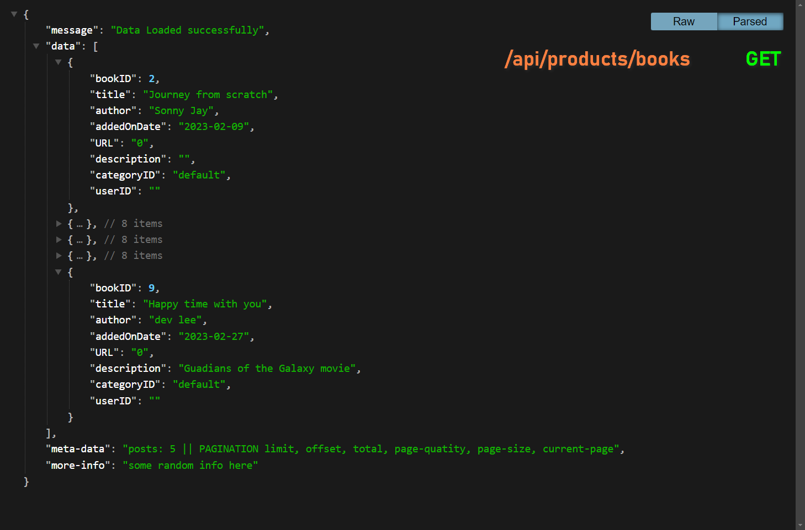
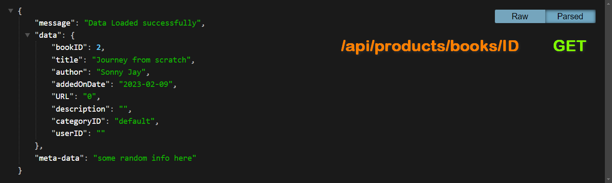

# Build a RestFull API in PHP

This is working standard PHP restfull API setup application with routing system and user Authentication


Frontend --> React JS


## Table of contents

- [Overview](#overview)
  - [Screenshots](#screenshots)
  - [Routing](#Routing)
  - [Error Handling](#error-handling)
  - [User Authentication](#user-authentication)
- [My process](#my-process)
  - [Built with](#built-with)
  - [What I learned](#what-i-learned)
  - [Continued development](#continued-development)
  - [Useful resources](#useful-resources)
- [Author](#author)
- [Acknowledgments](#acknowledgments)

## Overview
### Screenshots

Products fetch JSON Response


Single Product Display


### Welcome! 👋

Hi, I am Lesly Chuo.
Checking out this PHP Development Stack challenge.

This is working standard PHP restfull API setup application with routing system.
It serves data in a Javascript Object Notation (JSON) format which could easily be integrated in any application. Object Oriented Programming with namespace system is highly in use includeing features such as.


### Routing
Object Oriented Programming provides a variety of methods and approach to resolve a coding procedue. Making use of PHP associative arrays and call_user custom fuctions make this process quite interesting..

```php

// Sample Rout Display
$routes = array(

// Products
	   "GET@/api/products/books"	=> 	[ProductController::class, 'index'],
	"DELETE@/api/products/books" 	=> 	[ProductController::class, 'delete'],	// delete_key, auth_key

	  "POST@/api/category/books"	=> 	[CategoryController::class, 'update'],	// key, name, author, is_read

     "POST@/api/create/category"	=> 	[CategoryController::class, 'create'],	// name, author

// User
         "POST@/api/user/signup"	=> 	[UserController::class, 'signup'],	    // signup user data

          "POST@/api/user/login"	=> 	[UserController::class, 'login'],		// login user data
          /* ... */
);
```

Here we get a route mapped to a controller class pointing to a specific method in execution.


### Error Handling

Custom errors and exception handling to catch customize and return errors or exceptions when need be

### User Authentication

Full featured user signup/login registration system with token authentication


### Resource Management

User data control, profile, create products and category pages


## My process

Development still in progress... I will be updating promply


## Author

- Portfolio - [@Lesly, Dev_lee](https://www.letech-cg.com/portfolio)
<!-- - Frontend Mentor - [@ankain-lesly](https://www.frontendmentor.io/profile/ankain-lesly) -->
- Twitter - [@ankain-lesly](#)
- Linkedin - [@ankain-lesly](#)

- Whatsapp - +237 670710480


Complete rest API using pure objecti oriented PHP w
